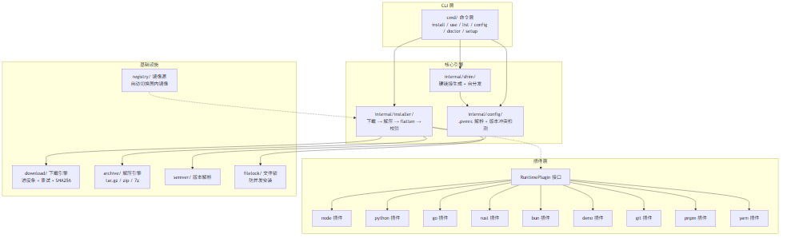
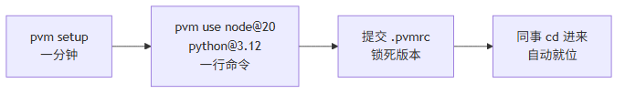

# 用了 PVM 才知道，环境隔离真不用跑 doctor，AI 都轻松了

## 两个问题

**问题一：同时维护多个项目，版本互相污染。**

一个 Node 18 的老项目，一个 Node 20 的新项目，一个 Python + Node 的混合项目。每天在三者之间横跳，脑子记不住版本。

忘了的结果：用 Node 20 给 Node 18 的项目跑了 `npm install`，lockfile 被高版本 npm 静默重写。CI 照着被篡改的 lockfile 装依赖 → CI 红了 → 你懵了。更阴的是构建脚本——build 用了 Node 20 才有的 `crypto.hash()`，你全局是 18，npm 不拦，脚本走了降级分支，构建全程 0 报错，上线后样式悄悄裂了。

**问题二：AI Skill 跑不起来，环境反复试错。**

AI 给你写了个 Python 脚本转 PDF，结果 `command not found: python`。然后它开始哐哐装环境，装完版本不对再换，顺手把你刚配好的东西动了。明明一分钟的事，环境拖成半小时。

根源都一样：**版本信息没跟项目走。**

---

## 解决一：项目环境隔离

**把版本锁在项目里，而不是锁在脑子里。**

项目根目录放一个 `.pvmrc`：

```ini
node = 20.11.0
python = 3.12.0
```

提交到仓库。任何人 clone 完 cd 进来，版本自动生效。切到隔壁项目，自动切。

怎么做到的？核心机制是 **Shim 硬链接拦截**：


```
~/.pvm/shims/
├── node    ───── 硬链接 ─────┐
├── npm     ───── 硬链接 ─────┤
├── python  ───── 硬链接 ─────┤──→  pvm.exe（同一个文件，12MB）
├── git     ───── 硬链接 ─────┤    零额外磁盘占用
├── rustc   ───── 硬链接 ─────┤
└── deno    ───── 硬链接 ─────┘
```

关键设计：

- **硬链接，不是 Shell 脚本。** nvm、asdf 的 shim 是 bash 脚本，Windows 上根本跑不起来。PVM 的 shim 是原生硬链接，Windows/macOS/Linux 一套逻辑，不依赖任何 shell。
- **实时读取，不是缓存。** 每次调用自动读当前目录的 `.pvmrc`，cd 进去的那一刻版本就已经对了，不需要手动 `pvm use`。
- **项目间完全隔离。** A 项目升级了依赖，绝不会因为全局环境被改就把 B 项目带崩。

对比一目了然：

| 工具 | 切换方式 | 管多少种 | Windows 原生 |
|------|----------|----------|:---:|
| nvm | 手动 `nvm use`，忘了就翻车 | 1 | ❌ |
| fnm | cd 自动切，但只管 Node | 1 | ❌ |
| asdf | cd 自动切，但 shim 是 bash 脚本 | 多 | ❌ |
| Volta | cd 自动切，架构焊死在 Node 上 | 3 | ❌ |
| **PVM** | **cd 自动切，硬链接 shim** | **9** | ✅ |

---

## 解决二：AI Skill 一键就位

AI Skill 最大的痛点不是脚本写不对，是**运行环境不在**。

你从社区下载一个 Skill，信心满满点执行 → `python: command not found`。然后 AI 开始装环境、试版本、修 PATH，整个过程重复试错，原本一分钟的事拖成半小时。

PVM 的解法：skil 作者在项目里放一个 `.pvmrc`：

```ini
python = 3.12.0
node = 20.11.0
```

你用的时候不需要先装一圈环境。cd 进来那一秒，shim 已经把 python 指向了 3.12.0，把 node 指向了 20.11.0。AI 直接跑脚本，不用装，不用试，不用修。


这就是 PVM 对 AI 最大的价值——**它不需要知道环境是什么版本，进目录就已经对了。**

---

## 技术架构

整个 PVM 的核心是**插件架构 + 单二进制自分发**：



### RuntimePlugin 接口

加新语言不动核心代码，靠的就是这个接口：

```go
type RuntimePlugin interface {
    Name() string
    Names() []string                          // 别名（node, nodejs）
    Shims() []string                           // 需要创建哪些 shim
    BasePath(version string) string            // 安装目录
    Install(ctx, version string) error         // 下载 + 解压 + 校验
    ListInstalled() ([]string, error)          // 已安装版本
    Validate(version string) error             // 安装后自检
    GetDownloadURL(ctx, version string) (string, error)  // 下载地址
}
```

Node 实现了，Python 实现了，Rust 也实现了。想加 Zig？照着抄一份，`RegisterAll()` 注册进去，核心代码一行不动。

### 自分发流程

当 Shell 调用 `node` 时，实际执行路径：

```
1. Shell 在 PATH 中找到 ~/.pvm/shims/node
2. node 是 pvm.exe 的硬链接，启动 pvm 主程序
3. os.Executable() 发现当前进程名为 "node"
4. 路径在 shims/ 下 → 判定为 shim 调用
5. 读 .pvmrc → 解析版本 → 转发给真实二进制
6. 真实二进制执行，返回结果
```

全套逻辑在 `cmd/root.go`，200 行不到。

---

## 国内镜像自动切换

遇到 GitHub API 403 或下载慢，自动切镜像，不用配任何环境变量：

| 运行时 | 镜像源 |
|--------|--------|
| node / python / bun / deno / pnpm / yarn / git | npmmirror.com |
| go | golang.google.cn |
| rust | rsproxy.cn |

---

## ⚠️ 注意事项：杀毒软件误报

PVM 的 shim 是 pvm.exe 的硬链接。杀软看到**同一个二进制在 shims 目录下出现十几次**，容易误判为病毒。

- 这是**误报**，请放心使用
- 安装时如被拦截，点击「更多信息」→「仍要运行」
- 或在 Windows Defender 中临时添加 `~/.pvm` 目录到排除项
- 后续计划购买代码签名证书（$300-500/年），从根源解决误报

如果你遇到了，也欢迎[提交文件给微软分析](https://www.microsoft.com/en-us/wdsi/filesubmission)，多一个人提交就快一步洗白。

---

## 上手

```bash
# 下载安装包，双击安装（setup 自动运行）

# 进项目，一行锁死所有运行时
cd your-project
pvm use node@20 python@3.12 bun@1.1

# 提交
git add .pvmrc && git commit -m "lock runtimes"
```

完。不需要装一堆工具，不需要配一堆环境变量，不需要在 README 里写"请确保你装了以下..."。**装一个 PVM，就够了。**



---

仓库 [github.com/Lycorxy/pvm](https://github.com/Lycorxy/pvm)，MIT 协议，v0.0.1。

如果这篇文章帮到了你，**欢迎转发给还在手动切版本的同事**。

遇到 bug 或者有需求，直接提 issue。v0.0.1 还在打磨，你的每一个反馈都在帮它变得更好。
